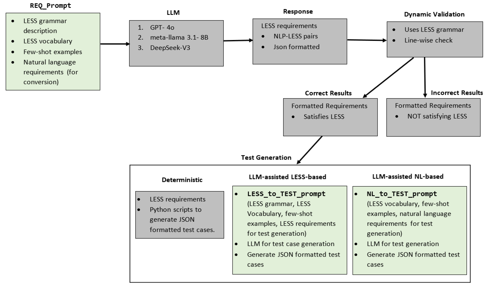

## LESS-Based Requirement and Test Case Generation

The scripts, prompts, and the requirement and test generation Python application in this project support the replicability of the experiments performed in the paper:

**_LESS is more: Guiding LLMs for Formal Requirement and Test Case Generation_**

<Details>
<summary><strong>Show BibTeX Citation</strong></summary>
  
```bibtex
@inproceedings{less_is_more,
  author       = {Shrestha, Abhishek and Schlingloff, Bernd-Holger and Großmann, Jürgen},
  title        = {LESS is more: Guiding LLMs for Formal Requirement and Test Case Generation},
  booktitle    = {Proceedings of the 3rd International Conference on Communication, Artificial Intelligence and Systems (CAIS 2025)},
  year         = {2025},
  address      = {Baghdad, Iraq},
  month        = sep,
  publisher    = {Springer},
  series       = {Communications in Computer and Information Science (CCIS)},
  volume       = {2693},
  isbn         = {978-3-031-07243-6},
  issn         = {1865-0937},
  doi          = {to be assigned}, 
  pages        = {372--389},
  note         = {Accepted March 2025; conference held September 17--18, 2025; to appear},
  keywords     = {Large Language Models, Controlled Natural Language, Requirements Engineering, Test Case Generation, Verification and Validation},
}
````
</Details>
---

More specifically, the repository provides the following artefacts:  

 1. Prompts used during the experiments.   
 2. Details of the models used.
 3. Results from the experiments — including both raw outputs from all models and aggregated results (e.g., individual error counts).           
      The raw outputs here not only show the results but also the word document provides analysis of the results. Which lines in the results were correct (exact mataches), incorrect, and why they were incorrect.   
 4. Python application that was used to run the experiments
    locally.

***Thus, this documentation not only covers the results but also the analysis of the results.***  

With the python application, you can run the entire experimentation workflow as depicted in the the figure below:

<p align="center">
  
  <br>
  <em>Experimentation Workflow: LESS requirement generated using LLMs followed by test case generation. Blocks using LLM prompts are colored green.</em>
</p>

Additionally, the Repo also contains a [Wiki](https://github.com/Abhishek2271/LESSGuaidanceForRequirementFormalization/wiki) that describes:  
1. Using the python application to perform experiments.
2. The artefacts (prompts, experimental results) for both industrial case studies that were implemented (VAD and E-GAS case studies).

---

# Case Study

## Datasets

*(Details to be added)*

## Models

*(Details to be added)*

## LESS Grammar

*(Details to be added)*

## Workflow

*(Details to be added)*

---

# LESS Requirement Generation

### Ground Truth

*(Details to be added)*

### Prompts
*(Details to be added)*

### Results
*(Details to be added)*


---

# Test Case Generation

### LESS-Based Test Case Generation

*(Details to be added)*

#### Ground Truth

*(Details to be added)*

#### Prompts
*(Details to be added)*

#### Results from Models

*(Details to be added)*

### NLP-Based Test Case Generation

*(Details to be added)*

#### Ground truth
*(Details to be added)*

#### Prompts
*(Details to be added)*

#### Results from Models

*(Details to be added)*
##### Results from models
*(Details to be added)*
